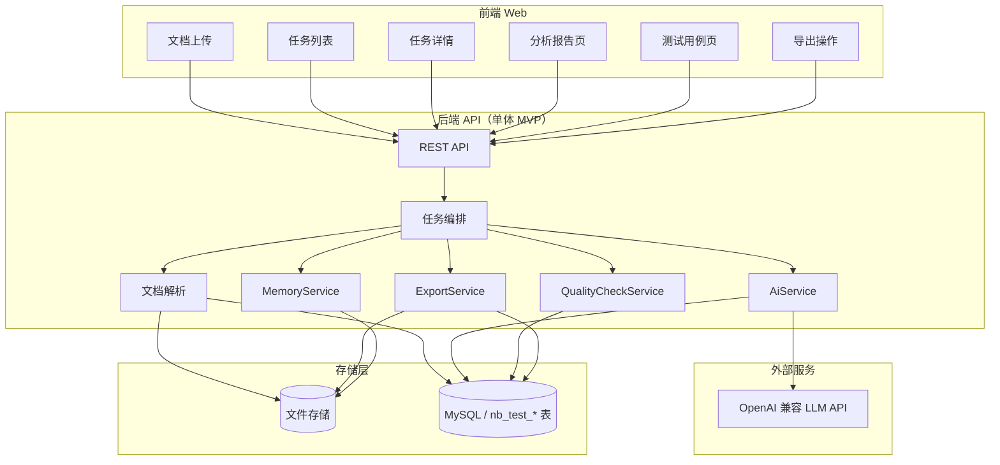
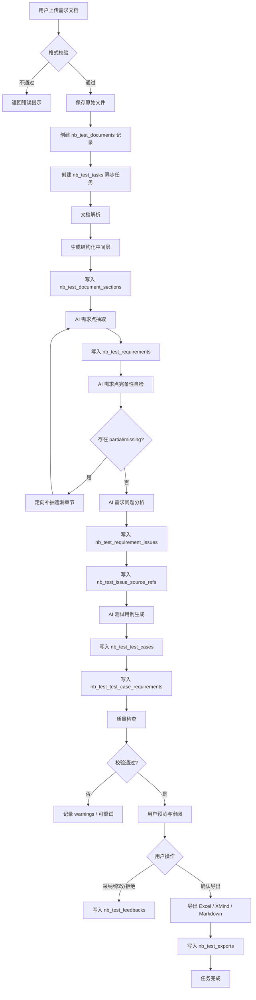
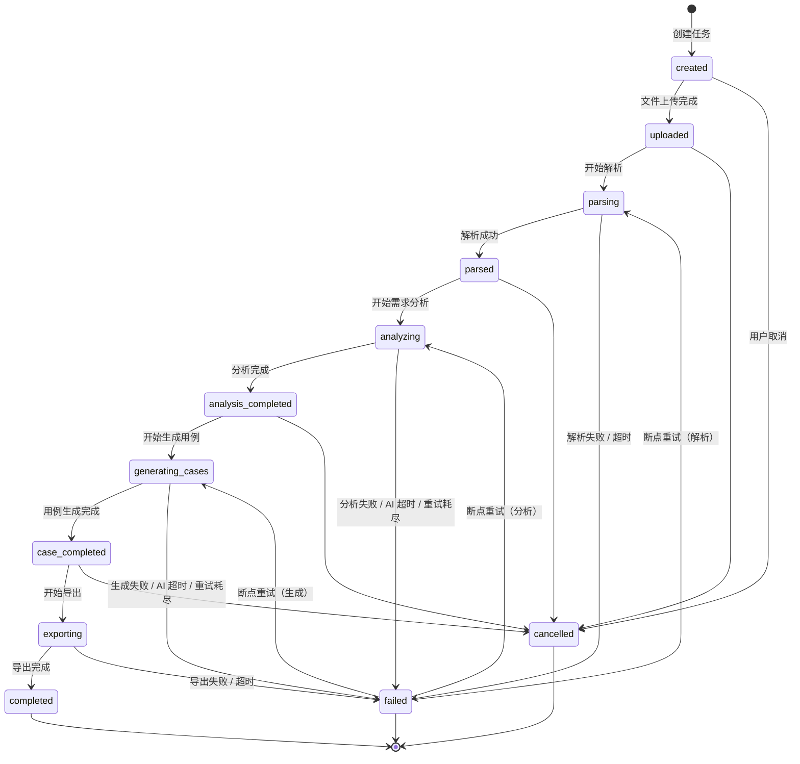
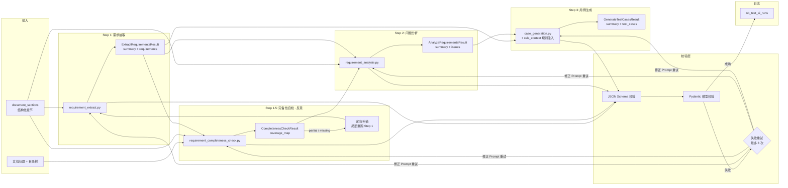
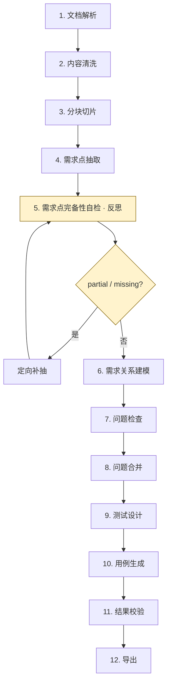
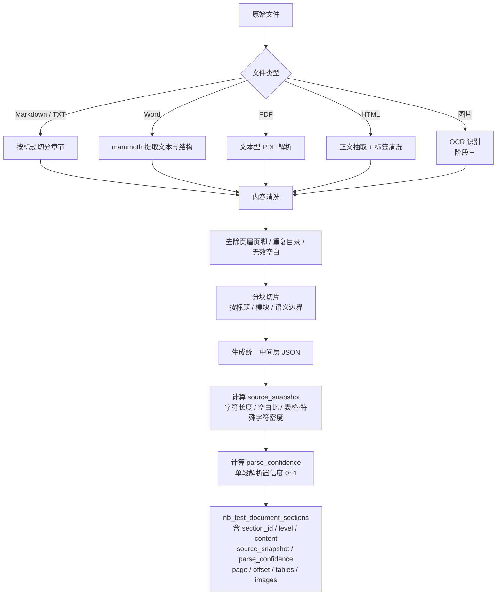
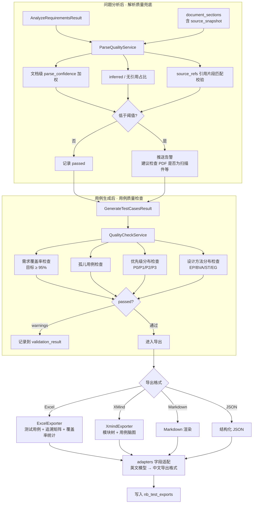
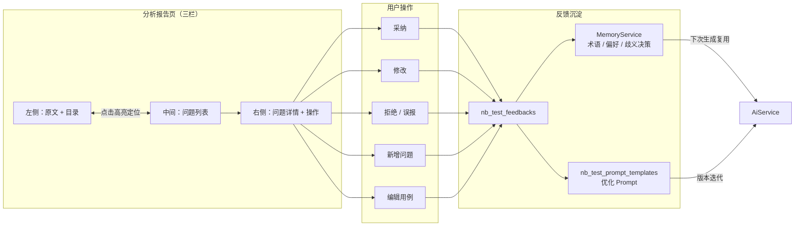
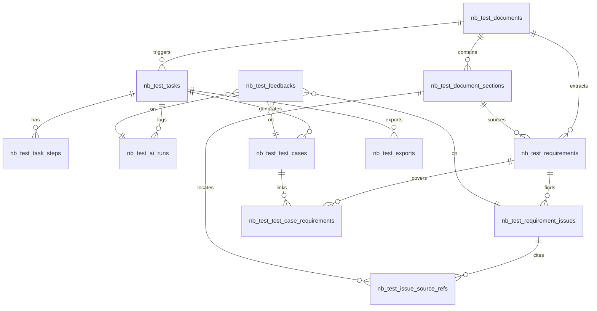
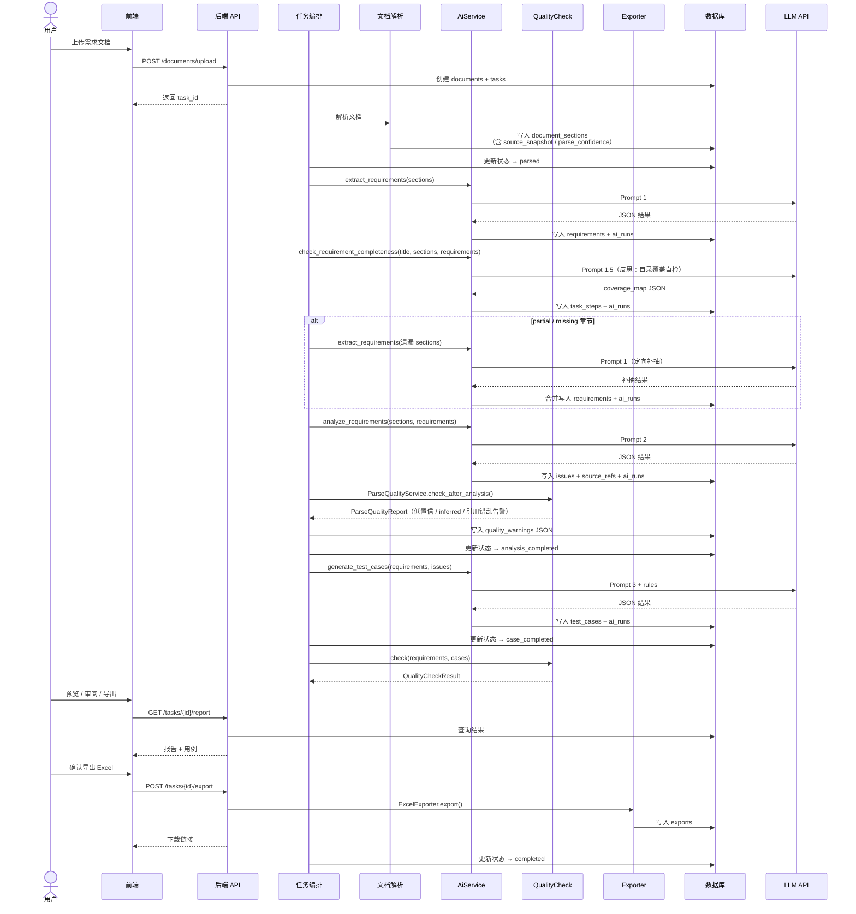

# 系统流程图

> 依据 [设计文档.md](./设计文档.md) 与当前 `backend/` 实现梳理。

## 1. 系统总体架构

---

## 2. 主业务流程（端到端）

---

## 3. 任务状态机

对应表：`nb_test_tasks`（主状态）+ `nb_test_task_steps`（步骤明细，含 `timeout_seconds` / `max_retry`）

> 轮询 Worker 需检测 `running` 步骤是否超过 `timeout_seconds`；超时写入 `error_code=step_timeout` 并按 `max_retry` 断点重试或置任务 `failed`（见 [设计文档 §2.5.1](./设计文档.md)）。

---

## 4. AI 流水线（AiService）

设计目标为 4 个核心 Prompt 阶段（抽取 → **完备性自检** → 问题分析 → 用例生成）；**当前后端已全部实现**。

> **隐式依赖**：问题分析（Step 2）强依赖需求抽取（Step 1）的召回率；若跳过完备性自检，遗漏章节上的缺陷将无法被后续步骤发现。

### AI 子步骤明细（设计目标）

| 步骤 | run_type | step_name | Prompt / 模块 | 输出 | 实现状态 |
|------|----------|-----------|---------------|------|----------|
| 需求摘要 + 拆分 | `extract_requirements` | `extract_requirements` | `requirement_extract.py` | 原子需求列表 | ✅ 已实现 |
| **需求点完备性自检（反思）** | `check_requirement_completeness` | `check_requirement_completeness` | `requirement_completeness_check.py` | 覆盖映射表（`covered` / `partial` / `missing`）+ 定向补抽指令 | ✅ 已实现 |
| 清晰度/完整性/一致性/风险检查 | `analyze_requirements` | `analyze_requirements` | `requirement_analysis.py` | 问题清单 | ✅ 已实现 |
| 测试用例生成 | `generate_cases` | `generate_cases` | `case_generation.py` + `rule_context` | 结构化用例 | ✅ 已实现 |

### 4.1 完整流水线（设计目标 12 步）

与 [设计文档 §4](./设计文档.md#4-ai-流水线设计) 对齐的全链路步骤，供 `nb_test_task_steps` 编排参考：

**完备性自检 Prompt 引导语（摘要）**：

- 基于文档标题和目录，抽取的需求点是否覆盖了所有章节？
- 是否存在整节/整段未被抽取的模块（附录、异常流程、权限说明等）？
- 某些章节是否只抽到摘要级描述，遗漏了具体规则或验收标准？

---

## 5. 文档解析流程

---

## 6. 质量检查与导出流程

---

## 7. 用户交互与反馈闭环

---

## 8. 数据流转关系

---

## 9. MVP 当前实现对照

| 设计模块 | 当前状态 | 代码位置 |
|----------|----------|----------|
| AiService 统一封装 | ✅ 已实现 | `backend/app/ai/ai_service.py` |
| 多模型混合路由 | ✅ 已实现 | `backend/app/ai/model_router.py` |
| 需求抽取 Prompt | ✅ 已实现 | `backend/app/ai/prompts/requirement_extract.py` |
| 需求点完备性自检 Prompt | ✅ 已实现 | `backend/app/ai/prompts/requirement_completeness_check.py` |
| 问题分析 Prompt | ✅ 已实现 | `backend/app/ai/prompts/requirement_analysis.py` |
| 用例生成 Prompt | ✅ 已实现 | `backend/app/ai/prompts/case_generation.py` |
| JSON Schema 校验 | ✅ 已实现 | `backend/app/ai/schemas/` |
| 规则上下文注入 | ✅ 已实现 | `backend/app/ai/rules/rule_context.py` |
| 原文快照 + 解析置信度 | ✅ 已实现 | `backend/app/document/section_snapshot.py` |
| 解析质量兜底告警 | ✅ 已实现 | `backend/app/quality/parse_quality_service.py` |
| 任务 quality_warnings 持久化 | ✅ 已实现 | `backend/app/tasks/task_service.py` |
| 步骤 timeout / max_retry | ✅ 已实现 | `backend/app/tasks/step_runner.py` + `step_policy.py` |
| 超时扫描 Worker | ✅ 已实现 | `backend/app/tasks/timeout_worker.py` |
| 流水线任务编排 | ✅ 已实现 | `backend/app/tasks/pipeline_runner.py` |
| 用例质量检查 | ✅ 已实现 | `backend/app/quality/quality_check_service.py` |
| Excel 导出 | ✅ 已实现 | `backend/app/exporters/excel_exporter.py` |
| XMind 导出 | ✅ 已实现 | `backend/app/exporters/xmind_exporter.py` |
| 记忆服务 | ✅ 已实现（文件型） | `backend/app/memory/memory_service.py` |
| 需求目录读取 | ✅ 已实现 | `backend/app/requirement_sources/` |
| REST API（任务列表/详情/报告） | ✅ 已实现 | `backend/app/main.py` + `backend/app/api/` |
| 文档解析服务 | ⏳ 待实现 | — |
| 异步任务队列 | ⏳ 待实现 | — |
| 前端页面 | ⏳ 待实现 | — |
| 用户反馈入库 | ⏳ 待实现 | — |
| PDF / HTML / OCR | ⏳ 阶段三 | — |

---

## 10. 时序图（单次任务完整链路）

